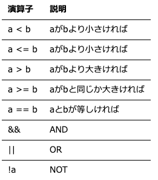

### 計算機科学演習　第4回

#### 目的:
条件分岐の使い方を理解する


#### 本日の内容:
`条件分岐（if）`の使い方を理解する


#### 条件分岐（if） 

```cpp
if(<条件>)
{
    <実行式１>
}
else if(<条件>)
{
    <実行式２>
}
else
{
    <実行式３>
}
```
- else文はなくてもよい
- <条件>用の演算子がある　　

条件式には次の等価、不等価、関係演算子が入る。 



<span style="color: red; ">注意点 等しいは`=`ではなく`==`とイコールが二つ続き</span>


#### printf関数
使用例：　
```cpp
printf(“フォーマット指定子を含む文字列”, 変数 )
```   
フォーマット指定子（フォーマット指定子は%ではじめ、記号で指定します）


#### 演習1
変数に格納された数値の正負を判断して、正負を表示するプログラムを作成せよ。

```cpp
#include <stdio.h>

int main()
{
    int a = 2;

    if(a < 0)
    {
        printf("aは負の数値です。¥n");
        printf("a = %d¥n", a);
    }
    else if(a > 0)
    {
        printf("aは正の数値です。¥n");
        printf("a = %d¥n", a);
    }
    else
    {
        printf("aは0です。¥n");
    }

    return 0;
}
```


#### scanf_s関数（キーボードからの入力）
使用例
```cpp
scanf_s(“フォーマット指定子”, &変数)
```  
<span style="color: red; ">注意点 &を変数につける！</span>（参照渡し）


#### 課題
キーボードから入力した数値の正負を判断して表示するプログラムを作成せよ。  

ヒント:
```cpp
#include <stdio.h>

int main()
{
    //キーボード入力する変数を宣言
    int a;

    //TODO:キーボード入力（scanf_s関数） -> 変数 aに数値を格納


    if(a < 0)
    {
        printf("aは負の数値です。¥n");
        printf("a = %d¥n", a);
    }
    else if(a > 0)
    {
        printf("aは正の数値です。¥n");
        printf("a = %d¥n", a);
    }
    else
    {
        printf("aは0です。¥n");
    }

    return 0;
}
```