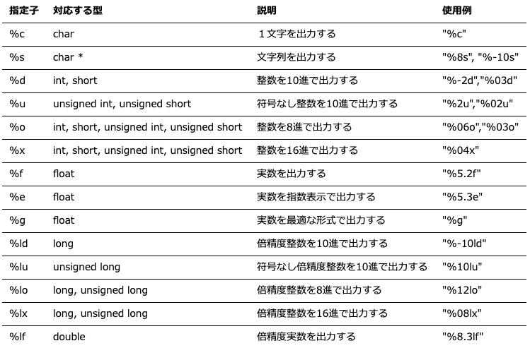
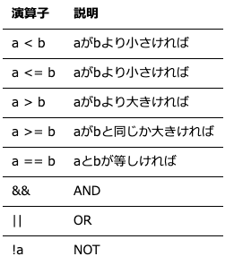

## 計算機科学演習　第5回

### 目的:
制御構造（ループ）の使い方を理解する

### 本日の内容:
1. 前回までの復習
2. `制御構造（for, while）`の使い方を理解する

### 前回までの復習（重要項目）
#### printf関数
使用例：　
```cpp
printf(“フォーマット指定子を含む文字列”, 変数 )
```   



#### scanf_s関数
使用例
```cpp
scanf_s(“フォーマット指定子”, &変数)
```  
<span style="color: red; ">注意点 &を変数につける！</span>（参照渡し）

#### 条件文（if）
```cpp
if(条件式)
{}
else if(条件式)
{}
else
{}
``` 


<span style="color: red; ">注意点 等しいは`=`ではなく`==`とイコールが二つ続き</span>

#### 疑似乱数生成関数
これらの関数を使用するためには“stdlib.h”が必要。
```cpp
#include <stdlib.h>

srand(unsigned seed); 
/* 擬似乱数の発生系列を変更する種(seed)を指定して乱数を発生させる． 
seedに同じ数値を設定すると同じ繰返しでrand関数は擬似乱数を発生する */

rand(); // 疑似乱数を発生させる。

```

### 制御構造（for, while）の演習
#### ループ処理: for
```cpp
for( 初期化式; 条件式; ループ式 ) {実行文;}
```
・条件式を満たしているならばループを継続させる。  
・条件式は初期化後すぐにも評価される。  
・パラメータは省略できる。（通常はこのような使用は行わない。）  
  
使用例（10回の反復処理を行う場合）:
```cpp
for (int i = 0; i < 10; i++) 
{
    繰り返し処理;
}
```
#### 演習1
1 + 2 + 3 + 4 + 5 + 6 + 7 + 8 + 9 を求めて最後に答えを表示せよ。

ヒント:
```cpp
#include <stdio.h>

int main()
{
    //変数 sum を初期化 
    int sum = 0;

    //TODO: ループ処理で1から9の和を計算する
    for()
    {

    }
}
```
#### 演習2
変数 i の初期値を5とし、１回処理を行う毎に i を 2 ずつ増やしていき、  
i < 10までの合計を求めよ。（5 + 7 + 9 =）。

ヒント:
```cpp
#include <stdio.h>

int main()
{
    //変数 sum を初期化 
    int sum = 0;

    //TODO: ループ処理の条件文を工夫する
    for()
    {

    }
}
```
#### ループ処理: while
```cpp
while( 条件式 ) {実行文; } 
```
・条件式を満たしているならばループを継続させる。  
・条件の判定はループの初めに判定される。

例：
```cpp
//変数 i を初期化
int i = 0;

while (i < 10) 
{
    繰り返し処理;
    i++;
}
```
#### 演習3
演習2をwhile構文で再計算せよ。（ファイル名: Ex03.cpp）
```cpp
#include <stdio.h>

int main()
{
    //変数 sum を初期化 
    int sum = 0;

    //TODO: 以下の処理を修正 ----

    int i =  

    //ループ処理の条件文を工夫する
    while (      ) 
    {
       
        
    }

    //ここまで ----

    //　計算結果の表示
    printf("Total: %d¥n" , sum);

    return 0;
}
```

#### forとwhileの使い分け
繰り返す回数が決まっているときはfor文、決まっていないときはwhile文を使います。

### for, whileと一緒に用いられる制御構文（continue, break）
#### continue
ループ処理のスキップを行います。  
例(正の整数のみを足し算する処理):
```cpp
while (i <= 5)
{
    // キーボードからの数値入力
    printf("正の整数を入力 : ");
    scanf_s("%d", &n);

    //入力された数値の正負の判定
    //負の数値であれば以降の処理をスキップする。
    if (n < 0)
        continue; //ループ処理のスキップ命令
    
    //正の数値であれば処理される
    sum = sum + n;

    i++;
}

```

#### break
ブロックやループから脱出します。  
例(正の整数が入力されている間、足し算する処理):
```cpp
// 条件式が指定されていないときは無限ループ
while ()
{	
    // キーボードからの数値入力　　	
    scanf_s("%d", &n);

    //入力された数値の正負の判定
    //負の数値であればループ処理を終了させる。
	if ( n < 0 )	　　
		break; //ループ処理の強制終了命令

    //正の数値であれば処理される
	sum = sum + n;
}

```

#### 課題
１~1000までの範囲で100個の乱数を発生させて、その結果から最大値、平均値（、標準偏差）を求めよ。（ファイル名: Ex04.cpp）

ヒント:
```cpp
#include <stdio.h>
#include <stdlib.h>

int main()
{
    //最大値と平均値を格納する変数
    int max, avg;

    //変数の初期化
    avg = 0;
    max = 0;
	
    //TODO: 以下の処理を修正 ----
	
    for (                        ) 
    {
        //1-100までの乱数を生成
        int i_rand = rand()%1000+1;
        //乱数を表示
        printf("i_rand: %d\n",i_rand);

        //平均値を計算する処理
        
        
        //最大値を計算する処理
        //
        if(     )
        {

        }
    }

    //ここまで ----

    //avg = avg/100;と同じ（省略形）
    avg /= 100; 

    //結果の表示
    printf("Max: %d\n",max);
    printf("Average: %d\n",avg);
    
    return 0;
}

```