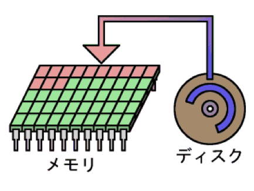

## 計算機科学演習　第7回

### 目的:
配列とポインタを理解する。

### 本日の内容:
1. 前回の復習
2. 配列とポインタ

### 前回までの復習（重要項目）
#### C言語の関数
C言語の関数は同じような処理を１つにまとめてしまうことができる。
C・C++言語の関数の特徴は、  
- 関数は<span style="color: red; ">引数</span>と<span style="color: red; ">戻り値</span>を持っている
- 関数は定義しないと使えない

具体的な関数の使い方（例：f(x, y) = 2x + y の関数をつくる）
```cpp
#include <stdio.h>

// funcという名前の関数を定義
// 引数: int型の変数 x と y 
// 戻り値: int型の数値
int func(int x, int y)
{
    return(2 * x + y);//戻り値はreturn文で返す
}

int main()
{
    int ans = func(1,2);
    printf("ans = %d¥n", ans);

    return 0;
}
```
<span style="color: red; ">注意: 同じ名前の関数があってはいけない。</span>  

#### void型
戻り値のいらない型が「void」。  
戻り値がvoid型の時、return文は必要ない。

#### グローバル変数
どの関数からも使用できる変数。

### 配列・ポインタを理解する
#### 配列変数の使い方と特徴  
- int a[<個数>]; で <個数> 個の変数が作れる。  
- a[0], a[1], ... というように使う。  
- カッコ内の数字は0から始まる。

#### 演習1
配列変数の使い方（int型の配列 - 2つの値を扱う場合）
```cpp
#include <stdio.h>

int main()
{
    // int型の配列を宣言
    // 2つの整数を扱う場合
    int a[2];

    // 1番目の箱に数値を代入する
    // C言語では1番目 -> [0]となる
    a[0] = 100;
    printf("a[0] = %d¥n", a[0];);

    // 2番目の箱に数値を代入する
    // C言語では2番目 -> [1]となる
    a[1] = 200;
    printf("a[0] = %d¥n", a[0];);

    // 1番目の箱に再度数値を代入する
    a[0] = 300;
    printf("a[0] = %d¥n", a[0];);

    return 0;
}
```
`Tips: 変数の初期化方法`  
配列変数の中身を初期化するときは、中身（要素）を { } で囲んでやります。各要素はコンマ（,）で区切ります。  
要素を全部書いているのであれば、[ ] の中に数字を書く必要はありません。勝手に中身の数だけ変数を作ってくれます。
```cpp
int nResults[] = {
    641, 703, 405, 598, 402, 752, 330, 0, 445, 662
};
```
#### メモリと配列
`要点`
- メモリは使用中のデータを置いておくところ
- メモリ上の位置を`アドレス`という
- アドレスは`普通の変数は前に & を付けて、配列変数と関数は名前だけ`で取得できる

メモリとはアプリケーションを実行するときの作業領域のこと。  
ディスク上にある実行ファイルをメモリ上にロードして、アプリケーションが実行される。  
決してディスク上で実行されるわけではない。



ディスクとメモリとを混同することがよくありますが、この２つは全く違うものである。 

ディスクはデータをずっと保存しておくことを目的としている。一方で、メモリは一時的な記憶を目的にしている。さらに、メモリは電源を切るたびに内容が破棄されます。  

実行ファイルに限らず、ファイルを使うには中身を一度メモリに読み出す必要がある。つまり、アプリケーションの使用中のデータは全てメモリ上にあることになる。もちろん、関数も変数もメモリの「どこか」にある。その「どこか」をアドレスという。アドレスはバイト単位の通し番号である。アドレスの取得方法は、普通の変数は & を付けるだけで知ることができる。配列変数や関数に至っては名前を書くだけである。アドレスは何の変哲もないごく普通の数値です。アドレスはただの数値ですから、それを変数に入れておくことができます。

#### 演習2
アドレスを確認する。
```cpp
 #include <stdio.h>

int main()
{
    int a; //int型の変数aを宣言
    char b[10];//char型の配列変数bを宣言

    //アドレスを表示する
    printf("a   : %d¥n", &a);//変数は変数名の前に&をつける
    printf("b   : %d¥n", b);//配列変数は変数名のみ
    printf("main   : %d¥n", main);//関数も関数名のみ

    return 0;
}
```
#### ポインタ
`要点`
- ポインタは`アドレスを格納するための変数`
- ある<型>のアドレスを格納するポインタはその`<型>に * を付けた型で宣言する`

変数はメモリ上に存在していて、変数はメモリ上の位置であるアドレスを持っている。  
このアドレスは単なる数値であることを確認した（演習2）。   
-> 単なる数値なら変数に入れてやることができる。このアドレスを扱う変数がポインタである。

#### 演習3
ポインタの使用方法
```cpp
 #include <stdio.h>

int main()
{
    int a; //int型の変数aを宣言
    int* p;//int型の変数pを宣言

    p = &a;//変数aのアドレスをpに代入する

    //アドレスを表示する
    printf("p   : %d¥n", p);//ポインタ変数に格納されたアドレス
    printf("&a   : %d¥n", &a);//変数aのアドレス

    return 0;
}
```

#### 参照
`要点`
- ポインタ変数に` * をつけると、アドレスの先に格納されたデータを扱える`

#### 演習4
参照の使用方法
```cpp
 #include <stdio.h>

int main()
{
    int a; //int型の変数aを宣言
    int* p;//int型の変数pを宣言

    p = &a;//変数aのアドレスをpに代入する

    a = 0;
    //数値を表示する
    printf("a   : %d¥n", a);//変数aに格納された数値
    printf("*p   : %d¥n", *p);//変数pのアドレスの先に格納された数値（参照）

    *p = 5; // 参照でデータにアクセスする
    //数値を表示する
    printf("a   : %d¥n", a);//変数aに格納された数値
    printf("*p   : %d¥n", *p);//変数pのアドレスの先に格納された数値（参照）

    return 0;
}
```
p の前に * を付けるだけでa の代わりに使えるようになる。  
ポインタを使って間接的に変数を扱うことを<span style="color: red; ">参照</span>と言います。

#### 課題
40人クラスの平均点を計算してその結果を表示するプログラムを作成せよ。

全員の点数  
641, 703, 405, 598, 402, 752, 330,   0, 445, 662,  
254, 710, 467, 530, 548, 485, 244, 396, 601, 510,  
532, 687, 623, 420, 647, 587, 490, 647, 575, 688,  
764, 633, 712, 312, 655, 425, 722, 631, 680, 602  

ヒント:  
<プログラムの流れと要点>
1. 配列を確保する。全員の点数を初期値で代入する。  
2. for構文で40回ループさせて点数の平均値を計算する。  

配列変数の初期化例:
```cpp  
int Tensuu [] = {
    641, 703, 405, 598, 402, 752, 330, 0, 445, 662
};
```

<サンプルプログラム>
```cpp
#include <stdio.h>

int main()
{
    int avg = 0;

    //TODO:配列変数を宣言して -> 初期化
    int Tensuu[] = 


    //TODO: for構文でループさせて平均値を算出
    for(        )
    {
        //40個　の積算値を計算する
        avg +=             ;
    }
    avg /= 40;

    //結果の表示
    printf("average = %d¥n", avg);

    return 0;

}
```

#### 課題の提出と出席確認
リンク先のフォームに出席確認と課題を登録してください。  
登録先: [https://goo.gl/forms/PvlEfZi2vOtxwvEx1](https://goo.gl/forms/PvlEfZi2vOtxwvEx1)