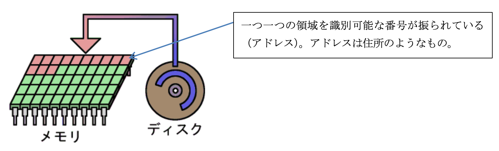

## 計算機科学演習　第8回

### 目的:
配列・ポインタをさらに深く理解する。

### 本日の内容:
1. 前回の復習
2. 配列・ポインタ 続き

### 前回までの復習（重要項目）
#### 配列
- 配列は`型 変数名[個数]`と宣言する。  
例（int型の配列で10個のデータを扱う場合）:
```cpp
int a[10];
```
- 配列のデータにアクセルする場合は`変数名[番号]`のよう使う。  
<span style="color: red; ">注意: カッコの数字は0から始まる</span>  
例（データ数はN個）:
 ```cpp
 a[0]; // 1番目のデータにアクセス
 a[1]; // 2番目のデータにアクセス
...
 a[N-1]; // N番目のデータにアクセス
 ```
#### メモリとアドレス
- プログラムを実行すると変数と関数はメモリ上のどこかに領域を確保する
- メモリ上の位置を<span style="color: red; ">アドレス</span>といい、番号が振られている
- アドレスは<span style="color: red; ">普通の変数は前に & を付けて、配列と関数は名前だけで取得できる</span>  



#### ポインタ
- ある <型> のアドレスを格納するポインタはその <型> に * を付けた型で宣言する  
  例： 
  ```cpp
  // 宣言の方法はどれでもOK
  int* p
  int *p
  int * p
  ```
- ポインタはアドレスを格納するための変数  
  ```cpp
  int a; // aはint型の変数
  int* p = &a; //  & を付けて変数aのアドレスを取得 -> 代入
  ``` 
- ポインタに * をつけると、pに入力されているアドレスのデータにアクセスできる。  
そのアドレスにある変数の代わりになる（参照）  
  ```cpp
  int a; // int型の変数aを宣言
  int* p // int型のポインタ変数pを宣言

  p = &a; // pに変数aのアドレスを代入

  *p = 5; // 変数aに5を代入（参照の機能）
  ```

### 配列再考
- 配列変数を引数にとるときは、配列変数のアドレスを渡し、ポインタで受ける
- ポインタも`配列変数と同じく [ ] で各要素を参照できる`
- 配列変数は、`メモリ上に連続して存在している`  
解説: [ ] は、<アドレス>[<番号>] としたときに、指定した <アドレス> から <番号> × <型の大きさ> だけ進めたところにある変数を使用するときに使うもの

#### 演習1
5個の数字を入力して表示するプログラム
```cpp
#include <stdio.h>

int main()
{
    // int型の配列を宣言
    int n[5]; // 5個のデータを扱う

    // for構文で5回の繰り返し処理を行う
    for(int i = 0; i < 5; i++)
    {
        // 入力を促す表示
        printf("%d 個目の数字を入力してください > ", i + 1);
        // scanf関数でキーボード入力
        scanf("%d", &n[i]);
    }

    // int型のポインタ変数 pの宣言
    int *p = n; //　配列 nのアドレスを代入

    // for構文で5回の繰り返し処理を行う
    for(int i = 0; i < 5; i++)
    {
        printf("入力された数字で %d 個目の数字は %d です。¥n", i+1, p[i]);
    }

    return 0;
}

```
#### 演習2
メモリ上に連続して存在しているか確認してみよう
```cpp
#include <stdio.h>

int main()
{
    // char型の配列を確保
    char array[10]; // 10個のデータを扱う

    // 配列名で取得されるアドレスを表示
    printf("array     : %d¥n", array);
    
    // for構文で10回の繰り返し処理を行う
    for(int i = 0; i < 10; i++)
    {
        // 配列の各データが格納されているアドレスを表示
        printf("&array[%d]  : %d¥n", i, &array[i]);
    }

    // char型のポインタ変数 pを宣言
    char* p = array; // 配列arrayのアドレスを代入

    // ポインタに格納されているアドレスを表示
    printf("pointer     : %d¥n", p);

    for(int i = 0; i < 10; i++)
    {
        //ポインタ変数と[]を使用してアクセスした領域のアドレスを表示
        printf("&p[%d]  : %d¥n", i, &p[i]);
    }

    return 0;
}
```
#### アドレスの演算
- アドレスの計算は、その型の大きさ（int型だと4バイト）に左右される
- アドレスの計算は、加減算しかできない

#### 演習3
```cpp
#include <stdio.h>

int main()
{
    // int型の配列を確保
    int array[4];
    // int型のポインタ変数を宣言
    int *p = array; // arrayのアドレスを代入

    // 配列arrayの先頭アドレスを表示
    printf("array[1]   : %d¥n", &array[1]);
    // 配列arrayの先頭アドレスに1を加算した結果を表示
    printf("array[1] + 1   : %d¥n", &array[1] + 1);
    // 配列arrayの2番目のアドレスを表示
    printf("array[2]   : %d¥n", &array[2]);

    return 0;
}
```

#### 参照渡し
- 引数をポインタにすると別の関数の内部変数を操作できる

例:
```cpp
// 参照渡しされた変数に対して5を加算する関数
void func(int* p)
{
    //（参照）pに格納されているアドレスの変数に5を加算する
    *p += 5;  
}

int main()
{
    // int型の変数aを宣言
    int a = 2;

    //　関数funcに変数aのアドレスを引数で渡す
    func(&a);

    printf("a = %d¥n", a);

    return 0;
}
```

西暦和暦変換プログラム  
演習4 グローバル変数を使用  
->  
課題 参照渡しを利用したプログラムへ修正

#### 演習4
西暦和暦変換プログラム
例: グローバル変数を使用
```cpp
#include <stdio.h>

int year;

int ChangeToWareki()
{
	int result = 0;
	int t = year * 10000;
	
	if (t < 18680908) 
	{
		//明治以前
		result = 0;
	} 
	else if (t < 19120730) 
	{
		//明治
		result = 1;
		year -= 1867;
	}
	else if (t < 19261225) 
	{
		//大正
		result = 2;
		year -= 1911;
	} 
	else if (t < 19890108) 
	{
		//昭和
		result = 3;
		year -= 1925;
	}
    else if (t < 20190430) 
	{
		//平成
		result = 4;
		year -= 1988;
	}  
	else 
	{
		//令和
		result = 5;
		year -= 2019;
	}

	return result;
	
}

int main()
{

    printf("西暦を入力してください > ");
    scanf("%d", &year);

    int result = ChangeToWareki();

	if( result == 0 )
	{
		printf("その年は明治以前です。¥n");
	}
	else if ( result == 1 ) 
	{
		printf("その年は明治%d年です。¥n", year);
	}
	else if ( result == 2 ) 
	{
		printf("その年は大正%d年です。¥n", year);
	}
	else if ( result == 3 ) 
	{
		printf("その年は昭和%d年です。¥n", year);
	}
	else if ( result == 4 ) 
	{
		printf("その年は平成%d年です。¥n", year);
	}
    else if ( result == 5 ) 
	{
		printf("その年は令和%d年です。¥n", year);
	}

	return 0;

}
```
#### 課題

グローバル変数を使用せず、ポインタを使用したプログラムに修正せよ。
ヒント： 
```cpp
#include <stdio.h>

// int year; <- グローバル変数を使用しない

// TODO: 参照渡しをするように関数を修正する
// 関数の引数を追加する
// 変数yearを修正する
int ChangeToWareki()
{
	int result = 0;
	int t = year * 10000;
	
	if (t < 18680908) 
	{
		//明治以前
		result = 0;
	} 
	else if (t < 19120730) 
	{
		//明治
		result = 1;
		year -= 1867;
	}
	else if (t < 19261225) 
	{
		//大正
		result = 2;
		year -= 1911;
	} 
	else if (t < 19890108) 
	{
		//昭和
		result = 3;
		year -= 1925;
	}
    else if (t < 20190430) 
	{
		//平成
		result = 4;
		year -= 1988;
	}  
	else 
	{
		//令和
		result = 5;
		year -= 2019;
	}

	return result;
	
}

int main()
{

    int year; //ローカル変数（内部変数）で新たにint型の変数 yearを宣言

    printf("西暦を入力してください > ");
    scanf("%d", &year);

    //TODO: 関数ChangeToWarekiに合わせて引数を修正する
    int result = ChangeToWareki();

	if( result == 0 )
	{
		printf("その年は明治以前です。¥n");
	}
	else if ( result == 1 ) 
	{
		printf("その年は明治%d年です。¥n", year);
	}
	else if ( result == 2 ) 
	{
		printf("その年は大正%d年です。¥n", year);
	}
	else if ( result == 3 ) 
	{
		printf("その年は昭和%d年です。¥n", year);
	}
	else if ( result == 4 ) 
	{
		printf("その年は平成%d年です。¥n", year);
	}
    else if ( result == 5 ) 
	{
		printf("その年は令和%d年です。¥n", year);
	}

	return 0;

}
```

#### 課題の提出と出席確認
リンク先のフォームに出席確認と課題を登録してください。  
登録先: [https://goo.gl/forms/Cwv9aZOcsggA54S83](https://goo.gl/forms/Cwv9aZOcsggA54S83)