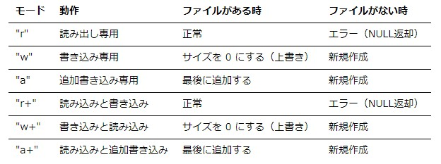

## 計算機科学演習　第11回

### 目的:
ファイル入力（テキストファイル）を理解する。

### 本日の内容:
1. 前回の復習
2. ファイル入力（テキストファイル）

### 前回までの復習（重要項目）
#### 型と型変換
##### データ型とは
- メモリ上に確保する領域のビット長や、確保した領域の扱い方などを決定するもの
- データ型は扱いたいデータの種類（例えば、整数、浮動小数点など）や値の範囲によって決定する

##### 暗黙の型変換
1. 代入時の変換: 左辺の型と右辺の型が異なっている場合は、`左辺の型に変換する`。

```cpp
//整数型
int a;
//浮動小数点型
double x = 3.1415;  

//double型のデータはint型に変換される。小数点以下は切り捨て
a = x;  // aには3が代入される
```
2. 式中の変換: 式中で異なる型の定数や変数が現れたときは、`精度の高い型に統一する`。

```cpp

//整数型
char a = 100;
//整数型
int b = 100;
//浮動小数点型
double c = 23.6;
//浮動小数点型
double kekka;

//char型とint型のデータはdouble型に変換されて計算される
kekka = a * b + c;
```

##### 明示的型変換（キャスト）
強制的に別の型に変換したいときに用いる。`キャストは変換したい型を()で囲み変数または計算式の前に置くだけ`。

```cpp
//整数型
int a = 3;
//整数型
int b = 2;
//浮動小数点型
float f;

//int型のデータaとbはfloat型に変換されて計算される
f = (float)a/b;
```

### ファイル入力(テキストファイル)を理解する
#### PCで使用するデータファイル形式
##### ファイル形式  
基本的にパソコンで扱われるデータは`バイナリデータ`。バイナリデータは0と1の集まり。我々が使用しているファイル形式には大きく`テキストファイル`と`非テキストファイル（バイナリファイル）`に分類できる。両方とも中身はバイナリデータで構成されている。テキストファイルは前回勉強した文字コードに準じてファイルが構成されている。  

##### テキストファイルの読み込み（入力）
- ファイルの入出力はFILE型を使う
- FILE型には  
　　入出力の現在位置(ファイル位置指示子)、  
　　ファイルの終端に達したかの情報(ファイル終了指示子)、  
　　エラー情報(エラー指示子)、  
　　関連するバッファへのポインタ  
などのファイルの入出力を行う上での必要不可欠な情報を管理している。

##### ファイル入出力によく使う関数
- fopen - ファイルを開いてそのファイルへのポインタを返す。  

例: sample.txtを読み出し専用で開く。
```cpp
fopen("sample.txt", "r");
```



- fclose – fopen でオープンされたファイルポインタで示されるファイルをクローズする。

例: ファイルポインタfpで指定したファイルを閉じる。
```cpp
fclose(fp);
```
- getc – ファイルポインタで指定したファイルからの１文字読み込み文字列に格納する。入力が終了したら NULL を戻り値で返す。
  
例: ファイルポインタfpで指定したファイルから1文字入力する。
```cpp
FILE *fp;
char str;
     :
str = getc(fp);
```
- fgets – ファイルポインタで指定したファイルからの１行読み込み文字列に格納する。入力が終了したら NULL を戻り値で返す。
 
例: ファイルポインタfpから一行読み込み文字列配列strに格納する。
```cpp
FILE *fp;
char str[256];
     :
fgets(str, 256, fp);
```

#### 演習1
テキストファイル（ファイル名：sample.txt）を読み込み、ファイルの中身を表示するプログラムを作成する。
```cpp
#include<stdio.h>
#include<stdlib.h>

int main()
{
    FILE *fp; //ファイルポインタの宣言
    char str[256]; //ファイルから読み込んだ文字列を格納する配列

    fp = fopen("F:¥¥sample.txt", "r"); //fopenでファイルを入力専用で開く
    if(fp == NULL) //ファイルがない場合はエラーを表示して終了
    {
        printf("[Error] File does not exist.");
        return 0;
    }

    while(fget(str, 256, fp) != NULL) //ファイルから1行ずつ読み込み
    {
        printf("読み込んだ文字列は.. %s¥n", str);
    }

    fclose(fp); //ファイルを閉じる

    return 0;
}
```

#### 演習2
文字列を数値にして表示するプログラムを作成する。
##### 便利な関数
文字列を数値（整数、浮動小数点）へ変換

- atof関数：文字列で表現された数値を浮動小数点型の数値に変換する。  
- atoi関数：文字列で表現された数値を整数型の数値に変換する。

例: 文字列 strに格納された数値を浮動小数点型に変換してdouble型変数avgに格納する。  
```cpp
#include<stdlib.h>

double avg;
char str[256] = "3.1415";

avg = atof(str);
```

```cpp
#include<stdlib.h>

int main()
{
    //文字列型変数を宣言して、データを初期化
    char str1[256] = "200";
    char str2[256] = "3.1415";

    //文字列データを整数型にatoi関数で変換する
    int a = atoi(str1);

    //文字列データを浮動小数点型にatof関数で変換する
    double b = atof(str2);

    //変数aとbをそれぞれprinft関数で表示する
    printf("a = %d¥n",a);
    printf("b = %f¥n",b);

    return 0
}
```

#### 課題
テストファイル（ファイル名：kadai_input.txt）から200個のデータを読み込み、平均値を計算して計算結果を表示するプログラムを作成せよ。

ヒント:
```cpp
#include<stdio.h>
#include<stdlib.h>

int main()
{
    FLIE *fp;

    char str[256];

    fp = fopen("F:¥¥kadai_input.txt","r");
    if(fp == NULL) 
    {
        printf("[Error] File does not exist.");
        return 0;
    }

    double data[200];
    for(int i = 0; i < 200, i++)
    {
        //TODO: ファイルポインタを使用してデータを読み込む

        //TODO: 文字列 -> 数値データへの変換
    }

    fclose(fp);

    //読み込んだデータから平均値を計算
    double average = 0.0;
    for(int i = 0; i < 200; i++)
    {
        //TODO: 平均値の計算
    }

    //計算結果の表示
    printf("average = %f¥n", average);

    return 0;
}
```