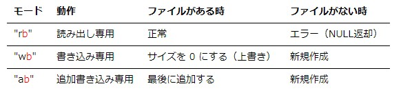

## 計算機科学演習　第13回

### 目的:
バイナリファイル入力と構造体を理解する。

### 本日の内容:
1. 前回の復習
2. ファイル入力（バイナリファイル）
3. 構造体

### 前回までの復習（重要項目）
#### ファイル形式
基本的にパソコンで扱われるデータはバイナリデータ。  
テキストファイルは文字コードに準じてファイルが構成されている。

#### テキストファイルの入力関数
- ファイルの入出力はFILE型を使う。
- ファイルを開くときにはfopen_s関数を使用する。
- ファイルを閉じる時にはfclose関数を使用する。
- データの読み出しにはgetc関数（一文字ずつ）、fgets関数（一行ずつ）を使う。
- データの書き出しにはputc関数（一文字ずつ）、fputs関数（一行ずつ）を使う。

#### 数値データの文字列変換
 - 数値データ等の型から文字列型への変換はsprintf_s関数を使用する。

### ビットマップファイル構造とバイナリファイルの開き方
#### ビットマップファイルの構造（ファイルフォーマット）
コンピュータグラフィックスでの色表現は光の三原色R（赤）、G（緑）、B（青）を使用する。ビットマップファイルはファイルの基本情報が含まれるファイルヘッダと各画素に対するRGBデータ部で構成される。

  
図 光の三原色


図 ビットマップファイルのフォーマット

#### バイナリファイルを開く
テキストファイルと同様にfopen関数を使用する。  
読み込みの場合は、モード指定で”`rb`”を指定する（テキストファイルの時は”r”を指定）。  
書き込みの場合は、モード指定で”`wb`”を指定する（テキストファイルの時は”w”を指定）。



#### 演習1
バイナリファイル（lena_std.bmp）をfopen関数で開くプログラムを作成せよ。  

ヒント　fopen_s関数とfclose関数を使用するだけ！

```cpp
#include <stdio.h>

int main()
{
    FILE *fp;

    // TODO: 入力ファイルをオープンする

    // TODO: 出力ファイルを閉じる

    return 0;
}
```

#### バイナリファイルへの読み込みによく使う関数（ファイルサイズ取得）
- fseek – fseek関数はファイルポインタ（fp）が指すファイル位置表示子（ファイルをどの位置を読み込んであるのか）の値を変更します。 
  ```cpp
  int fseek( FILE *fp, fpos_t offset, int whence);
  // whence: 基準位置でoffsetは基準位置から移動するバイト数。
  // 基準位置: whenceには以下の3種類のマクロが指定できる。
  //         SEEK_SET: ファイルの先頭
  //         SEEK_CUR: ファイルの現在位置
  //         SEEK_END: ファイルの終端
  // offsetのfpos_t 型とはファイル位置を格納するための型（実際はlong型の整数）。
  ```  

- fgetpos – fseek関数はファイルポインタ（fp）が指す,現在のファイル位置表示子の値を取得する。注意：<span style="color: red; ">posは参照渡しなので変数を渡すときには&が必要。</span> 
  ```cpp
  int fgetpos( FILE * fp, fpos_t * pos);
  ```

#### 演習2
ファイルサイズを取得して画面に表示するプログラムを作成せよ。

```cpp
#include <stdio.h>

int main()
{
    FILE *fp;

    fpos_t file_size; // ファイル位置表示子の値を格納する変数

    // TODO: 入力ファイルをオープンする

    // TODO: fseek関数でファイル位置表示子をファイルの終端に移動する

    // TODO: fgetpos関数でファイル位置表示子の値を取得する

    printf("file size: %lld\n", file_size); 
    // フォーマット指定子はlong型なので%lldを使用する

    // TODO: 出力ファイルを閉じる

    return 0;
}
```
#### バイナリファイルへの読み込み（入力）によく使う関数（データ読み込み）
- fread – バイナリファイルから値を読み込むにはfread関数を使用する。 
  ```cpp
  size_t fread( void * ptr, size_t size, size_t num, FILE * fp);
  // ptr: 読み込む領域へのポインタ
  // size: 要素 1 個あたりの大きさ
  // num: 要素の個数
  // fp: ファイルポインタ
  // 戻り値は読み取った個数（バイト数ではない）
  ``` 
  fpが指すファイルから，size（バイト単位）バイトで num個のデータを読み込み、ptr が指す配列に格納する。

  使用例: バイナリファイルからdouble型のデータを1個読みだす。
  ```cpp
  FILE fp;
   :
  double data;
  fread(&data, sizeof(double), 1, fp);
  ```

  使用例: バイナリファイルからdouble型のデータを200個読みだす。
  ```cpp
  FILE fp;
   :
  double data[200];
  fread(data, sizeof(double), 200, fp);
  ```
#### 複数の型をまとめて扱う（構造体）
配列で格納できるのは単一データ型のみ（char型を宣言するとchar型以外は格納できない）です。`構造体では複数のデータ型を複数格納することができる`。構造体の型を宣言するときには”`struct`”を使用する。

構造体の宣言:
```cpp
struct 型名
{
	型 メンバ名;
	:
	型 メンバ名;
}; 　// 構造体の最後には; (セミコロン)を必ず付ける。
```
注意（メンバ名）:　構造体ではその構造体を構成する変数をメンバ呼ぶ。変数名となんら変わりはない。

例：学生名簿を作る。氏名はchar型、学生番号や学年、クラスはint型という異なったデータ型をまとめ使いたい。
```cpp
struct Meibo
{
	char shimei;
	int gakuseki_bangou;
	int gakunen;
	int class;
};
```

例: プログラムでの構造体の使い方
```cpp
int main()
{
    struct Meibo
    {
            char shimei;
            int gakuseki_bangou;
            int gakunen;
            int class;
    };

    Meibo abc_highschool[200];

    for(int i = 0; i < 200; i++)
    {
        char shimei[256];
        int num_gakuseki;
        int num_gakunen;
        int num_class;
        :
        例えばテキストファイルからそれぞれの情報を読み込み。（処理に関しては省略）
        :
        abc_highschool[i].shimei = name;
        abc_highschool[i].gakuseki_bangou = num_gakuseki;
        abc_highschool[i].gakuseki_bangou = num_gakunen;
        abc_highschool[i].gakuseki_bangou = num_class;
        // 解説：構造体のメンバへのアクセスは.（ドット演算子）を使用する。
    }
}
```

#### 課題
ビットマップファイル（lena_std.bmp）から画像データを読み込みBitmapRGB構造体の配列に格納するプログラムを作成せよ。

ヒント:
```cpp
#include <stdio.h>

// RGBのデータを格納する構造体を宣言
struct BitmapRGB
{
    unsigned char blue;
    unsigned char green;
    unsigned char red;
};

int main()
{
    // ファイルポインタとファイルサイズを取得するための変数の宣言
    FILE *fp;
    errno_t error;
    fpos_t file_size;

    // 画像サイズ用の変数の宣言と値の設定
    const int x_size = 512;
    const int y_size = 512;

    // TODO: ファイルを開く

    // TODO: ファイルサイズを取得

    // ヘッダーサイズを計算する
    int file_header_size = file_size - (sizeof(char)*3*x_size*y_size);
    printf("file size: %lld¥n", file_size);
    printf("header size: %d¥n", file_header_size);

    //画像データ用の配列を確保
    BitmapRGB data[x_size * y_size];

    // ファイルから画像データの読み込み->格納する変数
    unsigned char red, green, blue;

    //TODO: fseek関数のオフセット機能を使って画像データの始まり位置まで位置表示子を移動する

    for(int i = 0; i < x_size * y_size; i++)
    {
        //TODO: fread関数でRGB成分をそれぞれ読み出す->変数に格納する

        //TODO: BitmapRGB型の配列dataのメンバ変数にそれぞれの値を格納する
        
        //データを表示して確認する
        printf("Blue, Green, Red: %d, %d, %d \n", blue, green, red);
    }

    // ファイルを閉じる
    fclose(fp);

    return 0;
}
```