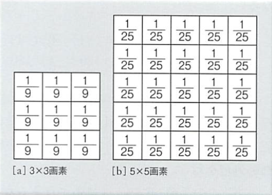
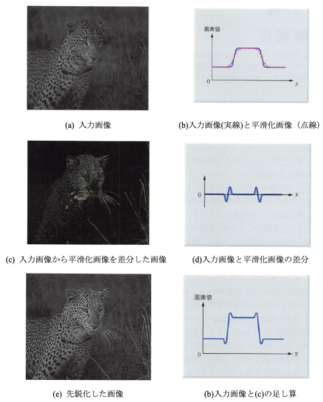
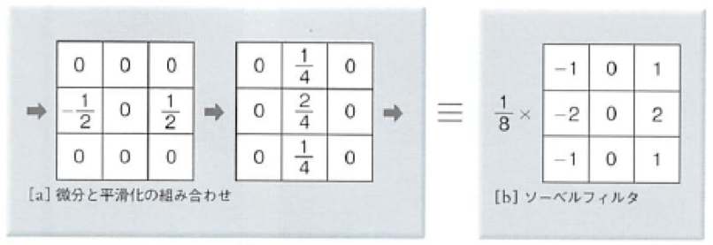
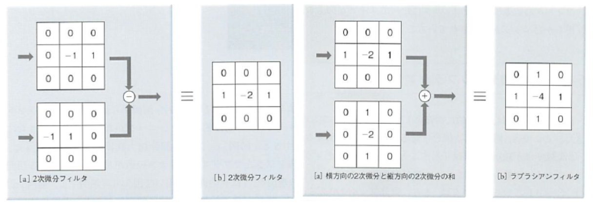

## 計算機科学演習　第15回

### 目的:
C言語による画像処理を理解する。

### 本日の内容:
1. 前回の復習
2. 画像処理（グレースケール変換、平滑化、先鋭化、エッジ抽出）

### 前回までの復習（重要項目）

#### 配列の動的確保
- malloc関数：動的なメモリの割り当て
  ```cpp
    void *malloc( size_t size);
    // sizeに割り当てるサイズをバイト単位で指定。
    // 戻り値で確保した配列へのポインタを返す。
  ```

- free関数：malloc関数で割り当てたメモリ領域を解放する。
  ```cpp
	free(動的に割り当てた配列へのポインタ); 
  ```

#### バイナリデータの書き出し

バイナリデータの書き出しにはfwrite関数を使用する。  
ポインタの先のメモリ領域から（サイズ×個数）バイトのデータをファイルに書き出す。
```cpp
fwrite(書き出しデータへのポインタ, サイズ(byte), 個数, ファイルポインタ);
```

### 画像処理

#### 演習1: カラー画像のグレースケール変換
R、G、B の3つの値が 0 〜 255 の任意の整数を取るものとすると、  
グレースケール変換後の値 Y （値の範囲は 0 〜 255 の整数とする）は、以下の式で求めらる。

輝度Y = ( 0.298912 * R + 0.586611 * G + 0.114478 * B )

輝度を`RGB全てに同じ値を設定すれば白黒画像に変換できる`。

#### 演習2: 平滑化（移動平均）
画像処理によってなめらかな濃淡変化を画像に与える処理を平滑化とよぶ。 

平滑化は画像に含まれるノイズなどの不要な濃淡変動を軽減するためにも用いられる。

図1.は3×3画素と5×5画素の大きさの平滑化フィルタの一例である。  このフィルタは、フィルタによって覆われる領域内の画素値の平均値を求めることになるため平均化フィルタとも呼ばれる。3×3画素のフィルタであれば周囲の8近傍の画素値との平均値を計算して中心画素の画素値を置き換える。

他にも中心に近いほど大きな重みを与える加重平均化フィルタや重み付けをガウス分布に近づけたガウシアンフィルタがある。

  
図1. 平均化フィルタ

#### 演習3: 先鋭化
元の画像の濃淡部分を残したまま画像のエッジ部分を強調する，画像の鮮鋭化処理について解説する。  

図2に示すような処理（アンシャープマスクキング）を行うとエッジを強調した先鋭化画像が得られる。

  
図2. アンシャープマスクキングによる画像の先鋭化

#### 演習4: エッジ抽出
画像中で画素値が急に変化するエッジ部分を取り出すエッジ抽出のためのフィルタについて解説する。  

これらは画像中から特徴や図形を検出したりするための前処理としても利用される。微分フィルタは、画像の濃淡が急激に変化するエッジ部分を抽出できる。  

図2.は微分フィルタ（ソーベルフィルタ）の1例を示している。図2は縦方向の画素値の変化率を求めている。エッジ抽出ではノイズの影響を強く受けるためソーベルフィルタでは平滑化も同時に行っている。

  
図3. 横方向の微分フィルタ（ソーベルフィルタ）

このような1次微分（差分）フィルタは画素同士の輝度の変化が大きいところを捉えるのには向いているが、輝度の変化が大きいところが必ずしも輪郭を示しているわけではない場合がある。  

そこで隣り合った画素の輝度値の変化だけでなく、周りに比べて「その変化の程度」が大きいところを抽出する方法が考えられる。  

隣り合った画素同士の変化量を1次微分だとすると、その変化の程度というのはそれをさらに微分すること、すなわち２次微分(ラプラシアン)することによって求まる。

  
図4. ラプラシアンフィルタ

#### 課題の提出と出席確認
リンク先のフォームに出席確認と課題を登録してください。  
登録先: [https://goo.gl/forms/BzYXeO41Guz7DwcD3](https://goo.gl/forms/BzYXeO41Guz7DwcD3)